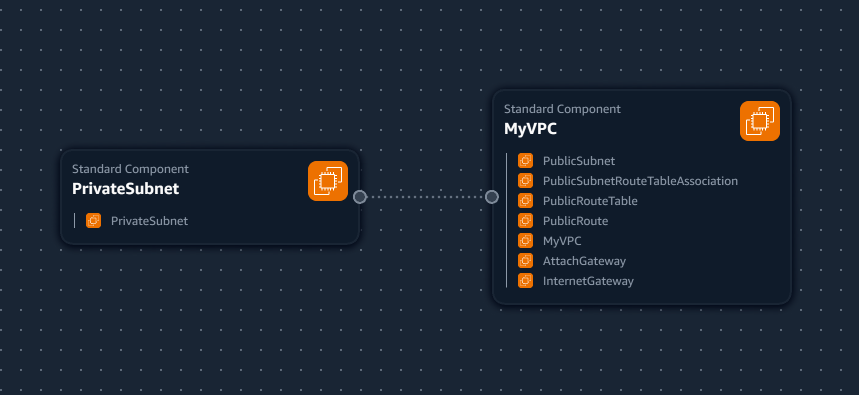
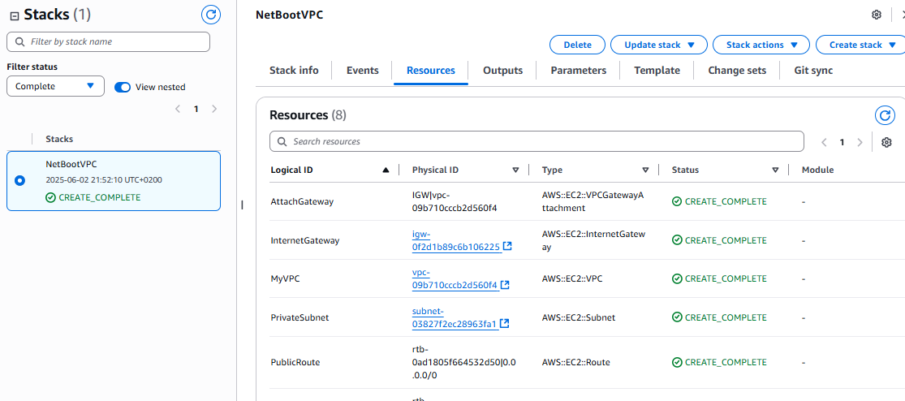
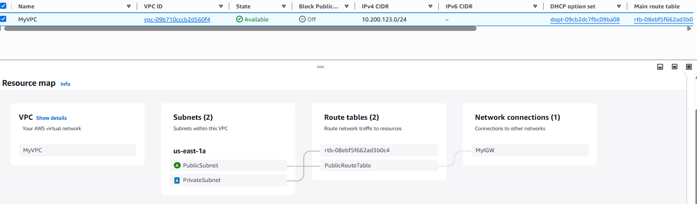

## VPC Settings

These are the VPC Settings I observed Tim setup for our cloud enviroment in AWS:

- VPC IPv4 CIDR Block: 10.200.123.0/24
- Ipv6 CIDR Block: No
- Number of AZs: 1
- Number of public subnets: 1
- Number of private subnets: 1
- NAT GATEWAYS: None
- VPC Endpoints: None
- DNS Options: Enable DNS Hostnames
- DNS options: Enable DNS Resolution

## Generated and Reviewed CFN Template

Watching the instructor's videos, I noted the VPC Settings, provided this to LLM to produce the Cloud Formation template to automate the provision of the VPC infrastructure.

- I had to ask the LLM to refactor the parameters so that it would not hardcode values and the template is more reusable.

## Generated Deploy Script

Using ChatGPT, I generated a bash script `bin/deploy`. 

I changed the `shebang` to work for all OS platforms.

## Visulization in Infrastructure Composer

I thought maybe we could visulize our VPC via Infrastructure Composer but its not tShe best representation.

## Installing AWS CLI

In order to deploy via the AWS CLI, we need to install it.

We follow the install instructions:
https://docs.aws.amazon.com/cli/latest/userguide/getting-started-install.html

## Deployed Resource to AWS

This is the CFN stack with the deployed VPC resources.

This is the resource map of the VPC deployed with CFN.

