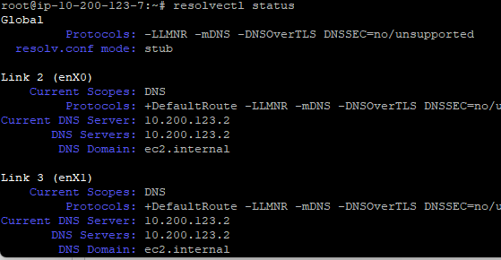
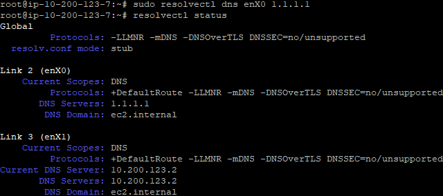

#  Linux Networking


### 1. `etc/hosts` file: 

This file is used when I want to "**force my machine**" to associate a domain name with a specific IP, before it asks any DNS server.

    - It allows you to link IP addresses to domain names.

In instances where you want to quickly test a website that is set up locally, instead of setting up a DNS server for this, you can link your server’s IP address to a domain name in the etc/hosts file. In this instance, your domain name of choice will resolve to IP 1.2..3.4 .

So the etc/hosts file is the first point of reference for resolving DNS, otherwise it’ll ask your DNS server.

### Mapping multiple domain names to the same IP:

You can safely map **many names to the same IP**.

The `/etc/hosts` file is read **line by line**, and each line maps **one IP** to **one or more names**.

For example:

```
    127.0.0.1   localhost

    127.0.0.1   dev.myapp.com
```

Both are valid:

"If someone asks for `localhost` or `dev.myapp.com`, send them to `127.0.0.1`."

The system doesn’t get confused because:

* It **resolves a domain name to an IP**, not the other way around.

* So when a program asks:

   “What is the IP for `dev.myapp.com`?”

   The system looks through `/etc/hosts`, finds the matching **name**, and returns the IP.

   The system looks up by **name**, not IP, so it’s not confused by duplicates.


### 2. `dig` command:

Similar to Windows `nslookup`.

You run:

```
 dig example.com
 ```

1. The system sends the query to **it's configured DNS server** — usually setup in `/etc/resolv.conf`.

2. That DNS server then:

   * Looks it up from cache, or

   * Contacts other DNS servers up the chain (like root → TLD → authoritative),

   * And sends back the IP address(es) for `example.com`.


#### You can check which DNS server is being used by`dig`: 

The bottom of the output:

;; SERVER: 192.168.1.1\#53(192.168.1.1)

That shows which DNS server `dig` used for that lookup. It might be:

* Your local router (e.g. `192.168.x.x`)

* A public DNS (like `8.8.8.8` or `1.1.1.1`)

* A custom one you’ve set

---

### Test using a diffferent server:


```
dig google.com @8.8.8.8
```

That asks **Google’s public DNS** to resolve instead.

Note: `dig` command skips `/etc/hosts` and queries DNS servers.

### 3. `netstat` command:

Works similarly to Windows.

It is a networking tool used to check running services and open ports.

### 4. `curl` command:

Works similarly to Windows.
     
**`curl` mimics what a browser or any client does** when it requests a webpage or an API.

* It sends an **HTTP request** (like GET, POST, etc.) to a server.

* It then shows you the **server’s response** (content, headers, status codes).


#### Troubleshooting with `curl`:

* **Check if a website or API is reachable** (does it return status code 200 or some error?).

* **See the exact content or data returned** by the server.

* **Test APIs or endpoints** by sending different kinds of requests.


### 5. `tcpdump` command:

1. **You can use the command to check if networking traffic is reaching your server.**

    For example:

    You deployed a service, but it’s not responding.

     Use tcpdump to confirm if any traffic is hitting your machine:


    ```
    sudo tcpdump -i eth0 port 80
    ```

    This will check if HTTP traffic is arriving at your server.


2. **You can also use it to debug connectivity between two servers.**

    Ubuntu server can't talk to RedHat server. 

    Use tcpdump to see if packets are being sent or received.

    ```
    sudo tcpdump \-i eth0 host 10.0.1.11
    ```

    This will show all packets between the two servers.

---

3. **You don’t understand the problem.**  

    Use tcpdump to save packets for someone else to inspect and save it to file (i.e `output.pcap`).

    ```
    sudo tcpdump \-i eth0 \-w output.pcap
    ```
    The file can be opened in Wireshark or use     `tshark` command, the terminal wireshark, to read the file. 

    ```
    tshark -r output.pcap
    ```

### **Hands On:**

We changed our Ubuntu server's from AWS default DNS to Cloudfare's DNS server.

We used the `resolvectl` command to change DNS configureations.

#### What is resolvectl?

- `resolvectl` is a systemd tool used in Linux to manage DNS settings, check current configurations, and change which DNS server your system uses.


To see which DNS server our system is using, we ran:

```
resolvectl status
```



This shows details about your network interfaces and their current DNS settings.


To change the default DNS for a specific network interface (ethnx0), we used:

```
resolvectl dns ethnx0 1.1.1.1
```

**Breakdown of the Command:**

- `resolvectl dns`: This tells the system you want to change the DNS settings.
- `ethnx0`: Specifies which network interface to modify.
- `1.1.1.1`: The new DNS server (Cloudflare).


   

After changing the DNS, we confirmed the update with `resolvectl status`.

 
 
This ensures your system is now using Cloudflare DNS instead of AWS’s default DNS.


