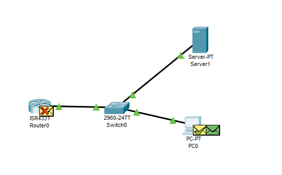

# State of the Network


In this Packet Tracer Lab, I simulated a basic local area network (LAN) setup where a **DHCP server automatically assigns IP addresses** to devices on the network. This helped me understand how devices get IP addresses dynamically and how broadcasts travel within a network.


## Devices Used

| Device     | Role                                        |
| ---------- | ------------------------------------------- |
| **Switch** | Layer 2 device so the devices can talk      |
| **Server** | DHCP server — gives out IP addresses        |
| **PC**     | Client that needs an IP                     |
| **Router** | Gateway for the network and external access |

---

## 1. Router Setup

* I gave it a **static IP address**:

  ```
  IP: 192.168.0.1
  Subnet Mask: 255.255.255.0
  ```
* This is because it's the **Default Gateway** — devices will use this to reach other networks.


## 2. Server Setup (as a DHCP Server)

### 2.1. Assigned the Server a Static IP

* IP Address: `192.168.0.100`
* Subnet Mask: `255.255.255.0`
* Default Gateway: `192.168.0.1`

    I assigned a static address because this server hands out IP addresses to other devices — it **should not rely on DHCP itself**. Static IP ensures it always stays reachable.

---

### 2.2 Enabled DHCP Service

* DHCP turned ON in server settings.
* Set the DHCP Pool (range of IPs it can give out):

  * **IP Range:** Starts from `192.168.0.2`
  * **Default Gateway:** `192.168.0.1`
  * **Subnet Mask:** `255.255.255.0`
  * **Starting IP:** `192.168.0.101`
  * **Max Users:** 100 (means it can give out 100 IP addresses)


## On the PC: Used Command Prompt to Check IP Assignment

### Step 1: Checked IP

```bash
ipconfig
```

* No IP was assigned yet.

### Step 2: Requested an IP from DHCP 

```bash
ipconfig /renew
```

* Server asked for an IP.
* Got assigned: `192.168.0.101`


---

## What Happens Behind the Scenes (DHCP Flow Summary)



### Step 1: DHCP Discovery (Broadcast)

* The PC or device says:

  > "Hello? I need an IP! Is anyone out there?"
* Sent as a **Layer 2 broadcast**.
* Destination Port: **UDP 67**
* No idea who the DHCP server is — just hoping someone responds.

### 📶 Step 2: Broadcast Travels

* **Switch**: Forwards the broadcast to **all devices**, **except the one it came from**.
* **Router**: Receives it, but **drops it**.

  * Why? Routers don’t forward broadcasts (unless configured as DHCP Relay).
  * Also, **no service listening on port 67**.
* **Server**: Sees the message and replies!

  * It's listening on port 67.
  * Sends back an **offer** with an IP, subnet, and default gateway.

---

## Notes on ARP

While all this is happening:

* Devices are also using **ARP (Address Resolution Protocol)** to learn MAC addresses.
* For example:

  > “Who has IP 192.168.0.1? Tell me your MAC address.”
* ARP helps devices map IPs to MAC addresses so they know exactly where to send packets.

---

