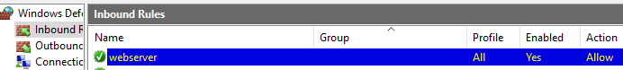
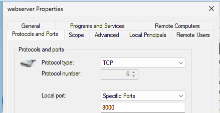
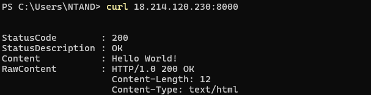

## Windows Firewall Rules

#### A Firewall:

- A firewall **protects a device by controlling network traffic**. 

- It controls **incoming and outgoing traffic**  and decides **which data is allowed in or out**, blocking potential threats while allowing trusted connections.

### Windows Firewall

- Windows Firewall is a built-in to the Windows OS.

    - It is a **host-based** firewall, meaning it runs directly on an individual computer or device, rather than on a separate network firewall or router. For example, **AWS Security Groups (SGs)** act as an **additional layer of protection**, but they do not replace the host-based firewall. OS firewalls don’t know about SGs. 

#### 1. **How Windows Firewall Works:**

* **Filters traffic** based on IP addresses, ports, and applications.  
* **Blocks unknown connections** to prevent unauthorized access.  
* **Allows safe applications** to communicate on the network.  

#### 2. **Firewall Rules:**

The default behavior of Windows Firewall is to:

    - block all incoming traffic, unless solicited or matching a rule.
    - allow all outgoing traffic, unless matching a rule.

#### 3. **Firewall Profiles (Security Levels):**

Windows Firewall offers three network profiles: domain, private and public. The network profiles are used to assign rules. For example, you can allow a specific application to communicate on a private network, but not on a public network.

* **Domain Network** → Applied when connected to a company’s network (Active Directory).  
* **Private Network** → Used for home or trusted networks (Wi-Fi at home).  
* **Public Network** → Extra protection for **coffee shops, airports, hotels**, etc.

### **Firewall Testing - Hands-On**  

#### **1. Local Firewall Testing**  
- When testing firewalls on the **same machine (localhost)**, rules won’t block traffic because it's all within the local system.  
- To properly test firewall restrictions, we need to **access the server from another device**.  

#### **2. AWS Windows Server Firewall Testing** 

- We launched a **Python web server** on `port 8000` to serve a static page.  
- By default, **Windows Firewall blocks all inbound connections** unless explicitly allowed.  
- We manually **added an inbound firewall rule** to allow traffic on `port 8000`. 

 
- Additionally, we had to **open port 8000** in **AWS Security Group** settings, otherwise, the traffic would still be blocked at the cloud level. 

- From our **local machine**, we tested the connection using **curl** and successfully reached the server:

 

This confirms that **firewall rules + security groups** work together to control network access. 

