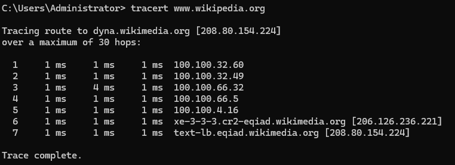
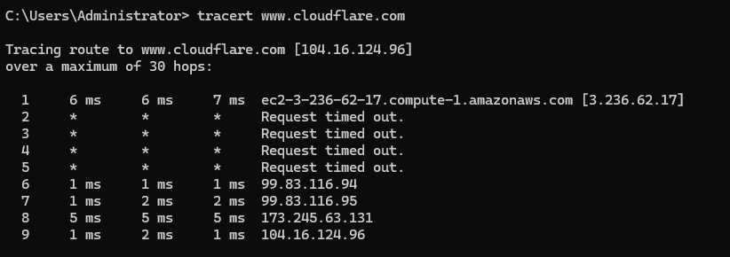
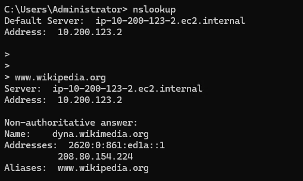
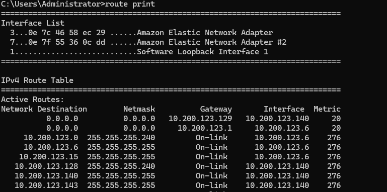

# Windows Networking tools

## 1. **Ping Command:**


`ping` is a tool used is used to test network connectivity between a computer and another device or website. It works by sending **ICMP Echo Request packets** and waiting for a response to measure speed and detect issues.

To check if a website or server is reachable:

```sh
ping wikipedia.`org
```


This will send packets to Wikipedia and show:
- Response time (latency in milliseconds)
- Packet loss (if some requests fail)
- IP address of the destination.

### Troubleshooting with Ping:

- Check internet connection → Ping Google (ping 8.8.8.8) to see if your internet is working.
- Test response time → Measure delays between you and a remote server.
- Diagnose network issues → If packets are lost or slow, there may be congestion or firewall blocks


## 2. **Traceroute Command**:

 **Tracert** helps you see the path data takes to reach its destination and can reveal network connection issues.

```
tracert
```

1. **Hop Numbers** – Each row represents a "hop," which is a router the packet passes through on its way to the final destination.  
2. **Response Times** – Three time values per hop indicate how long (in milliseconds) it takes for the packet to reach that router and come back.  

3. **IP Addresses & Hostnames** – Shows which servers or routers the packet encounters.  
   * If a specific hop shows high delays, that router might be causing lag.  
   * If the trace stops early or a hop is unreachable, it may indicate a failure or routing issue.

 * **Low, consistent times** \= healthy connection.  
   * **Sudden spikes** \= possible network congestion or slow routers.  
   * **Stars (`* * *`) instead of times** \= no response, meaning the router could have a security feature setup to block that specific traffic, or a firewall rule maybe blocking traffic etc.

### Troubleshooting with Traceroute:

I used `tracert` to compare routing paths between two sites, `Wikipedia` and `Cloudfare`.

**Wikipedia:**



* First Hop (Local Network) 
   - The first device is an AWS-hosted instance (`ec2-3-236-62-17.compute-1.amazonaws.com`), meaning the request starts from a cloud-based environment.
* The **Wikipedia server (208.80.154.224)** is reached in **7 hops**, which is pretty fast.  
* **All response times are low (mostly 1ms)**, suggesting a smooth path with no major delays or congestion.  
* There are no missing hops (`* * *`), meaning all routers responded correctly.  
* My **security group and IP rules** are allowing proper traffic flow.

**CloudFare:**




- First Hop (Local Network)
   - Again, the first device is an AWS-hosted instance (`ec2-3-236-62-17.compute-1.amazonaws.com`), meaning your request starts from a cloud-based environment.
   
* (Hops 2-5) show `Request timed out.` This could mean:
     - The routers are **configured to block ICMP requests** (common in security setups).
     - There’s **packet loss or network congestion** at these points.
     - The route is **taking an alternate path**, skipping visible responses.

* (Hops 6-9) shows successful responses:
   - The connection resumes at **99.83.116.94** and **99.83.116.95**.
   - **173.245.63.131** and **104.16.124.96** belong to Cloudflare, confirming the request reached its destination.


    The traceroute output suggests a **stable connection**, but the timeouts indicate **hidden or blocked hops** along the way. 

### Notes
- **If the final hop succeeds**, the connection is working fine despite the timeouts.
- **If the final hop fails**, check for **network blocks, firewall rules, or ISP routing issues**.
- **High latency spikes** at any hop could indicate **network congestion** or **slow routing**.
- **Unexpected routing** If a packet takes an odd path or unusual detours, it might be due to ISP routing changes or misconfigurations.

## 3. **Nslookup Command:**

This command is a DNS related command.

**`nslookup`** is a crucial tool for **DNS troubleshooting** and verifying whether a domain name resolves correctly.

### **Troubleshooting for `nslookup`:**



1. **Check your own DNS server**

   * Running `nslookup` without arguments shows your **default DNS server** and its **IP address** which is useful for confirming **which DNS resolver your system is using**. 

2. **Find a site’s IP address**

    for example:

    ```
    nslookup wikipedia.org
    ```

   * The response gives Wikipedia’s **IP address** and the **DNS server** resolving it.
   
   
   * If unsure whether a DNS lookup is correct, you can compare results using different DNS providers like **Google’s (`8.8.8.8`) or Cloudflare’s (`1.1.1.1`)**.
   
3. **Verify server configuration**

   * From **Server A**, you can check if **Server B’s** DNS is properly set up.  
   * If the **returned IP** is wrong or missing, there’s likely a **misconfiguration** in the DNS records.  
   * If **DNS fails entirely**, that means the name **isn’t resolving**, requiring further fixes.

### **Troubleshooting with `nslookup`:**

* **Wrong IP resolves:** Check the DNS records and correct them.  
* **No response:** The DNS server might be down or misconfigured.  


## 5. **Netstat Command:**

This command is that checks active services, and their listening ports. 

```
netstat
```

### **Troubleshooting with `netstat`**

1. **Checking which ports are in use**: Helps confirm if a specific service is running.  
2. **Detecting unwanted or unexpected connections**: Helps identify potential security risks.  
3. **Troubleshooting network issues**: If a service isn't working, check if it's listening on the correct port.  
4. **Verifying firewall rules**: If a port is supposed to be open but isn't listed, there may be a firewall blocking it.

## 5. **Route Command:**

 `route` is a command used to **view and manage routing tables**, which determine how network traffic moves from one place to another.

 It shows all active routes on your system.

**What is a Routing Table?**

A **roadmap** for your network, it tells your system **where to send data** based on destination IP addresses. Each row in the table represents a **route**, specifying:

* **Destination** (where the packet is going)  
* **Gateway** (next hop if needed)  
* **Interface** (which network adapter is used)  

### **Troubleshooting with `route`**

I used `route print`, which prints out the routing table with all active rotes on the network:




1. **Destination: `0.0.0.0` via Gateway `10.200.123.129`**  
   - All traffic that does not match a specific route is sent to `10.200.123.129`, which acts as the **default gateway** for reaching external networks (e.g., the internet).  

2. **Destination: `10.200.123.0` via Gateway `10.200.123.1`**  
   - Traffic going to `10.200.123.0/24` is routed through `10.200.123.1`.  
   - `10.200.123.1` is another gateway within the local network belonging to the secondary NIC. 

3. **Destination: `10.200.123.6` (On-Link)**  
   - This device is **directly connected** to the network, meaning **no gateway is needed** to reach it.  
   - "On-Link" routes indicate that communication happens within the same network.  
  

4. **Metric Values**  
   - Lower metric values (**20**) indicate preferred routes.  
   - Higher values (**276**) are usually for local connections. 

Notes:

- **Incorrect routing:** Check for wrong gateway entries.  
- **No internet access:** Look for missing **default gateway** (`0.0.0.0` route).  
